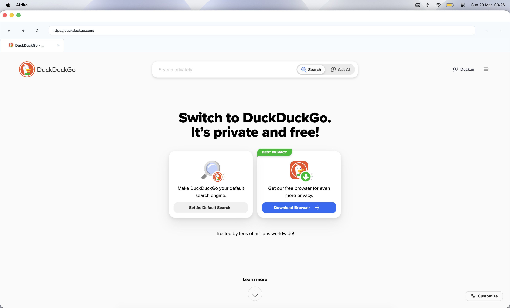

# Afrika Browser

Afrika is a lightweight desktop web browser built with C++ and Qt WebEngine. The project focuses on clean UI, simple architecture, and easy maintainability.



## Highlights

- Modern, compact UI with an ice-white theme
- Tabbed browsing with favicon support
- Navigation controls (back, forward, reload)
- Address/search bar with URL-or-search behavior
- Session save and restore
- Configurable homepage and dark mode toggle
- Centralized UI styling and theme tokens

## Tech Stack

- C++17
- CMake (Ninja supported)
- Qt 6 Widgets
- Qt 6 WebEngine

## Project Structure

```text
src/
	main.cpp
	storage/
		SessionStorage.*
		Settings.*
	ui/
		BrowserWindow.*
		BrowserWindowMenu.cpp
		BrowserWindowNavigation.cpp
		BrowserWindowSession.cpp
		BrowserWindowTabs.cpp
		UIStyleSheet.*
		UIStyleSheetToolbar.cpp
		UIStyleSheetTabs.cpp
		UIStyleSheetDialogs.cpp
		UITheme.h
	utils/
		UrlUtils.*
```

## Requirements

- C++ compiler with C++17 support
- CMake 3.16+
- Qt 6 (Widgets + WebEngine modules)

## Installation

### macOS (Homebrew)

```bash
brew install cmake ninja qt qtwebengine
```

### Ubuntu/Debian

```bash
sudo apt update
sudo apt install -y build-essential cmake ninja-build qt6-base-dev qt6-webengine-dev
```

## Build

From the project root:

```bash
cmake -S . -B build -G Ninja -DCMAKE_PREFIX_PATH=/opt/homebrew/opt/qt/lib/cmake
cmake --build build
```

Notes:
- The CMAKE_PREFIX_PATH above is the common Homebrew Qt path on macOS.
- On Linux, you usually do not need to pass CMAKE_PREFIX_PATH if Qt was installed from apt.

## Run

```bash
./build/Afrika
```

## Configuration and Data

Afrika stores local data in user directories:

- Settings/session config: ~/.config/afrika
- Cache/storage data: ~/.cache/afrika

Paths are resolved through Qt standard locations and may vary by platform.

## Development Notes

- Keep UI logic split by responsibility (toolbar, tabs, dialogs, navigation, sessions).
- Keep styles centralized in the UIStyleSheet modules and UITheme tokens.
- Prefer small, focused files for maintainability.

## Troubleshooting

- If CMake cannot find Qt on macOS, provide CMAKE_PREFIX_PATH explicitly.
- If WebEngine fails to link, verify that qtwebengine is installed and matches your Qt version.
- For a clean rebuild:

```bash
rm -rf build
cmake -S . -B build -G Ninja -DCMAKE_PREFIX_PATH=/opt/homebrew/opt/qt/lib/cmake
cmake --build build
```

## License

This project is licensed under the GNU General Public License v3.0.

See [LICENSE](LICENSE) for the full license text.
